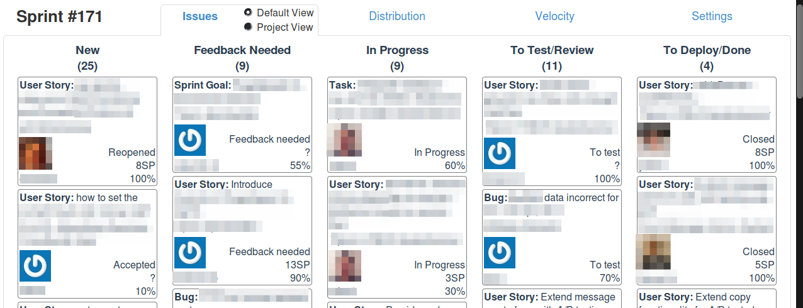
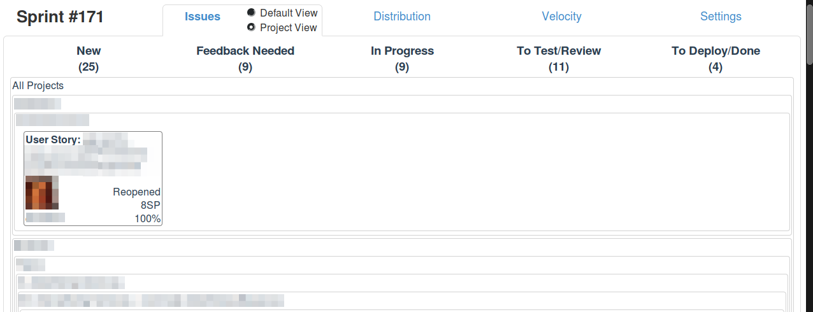
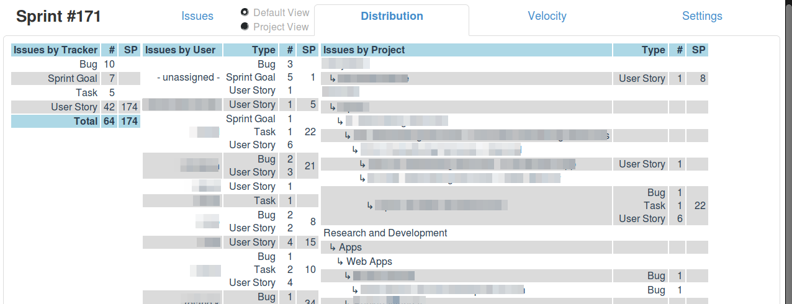
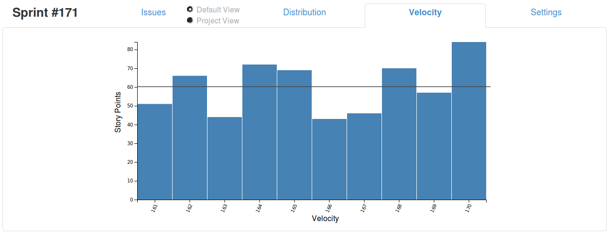
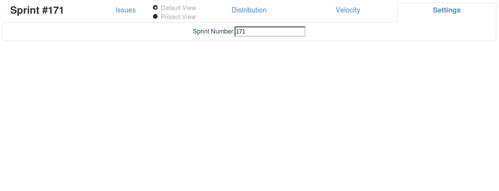

# RESTmine SCRUM Board

> A Scrum Board based on the REST API of Redmine.

* built upon the REST-API of Redmine 3.3
* requires set-up of two custom issue fields
    * *Sprint Number*
    * *Story Points*
* client and server part
    * hide the API-key server-side & do some pre-calculations (velocity)
    * server is written on NodeJS, client is a [VueJS](https://vuejs.org/v2/guide/) application

## Usage

1. Copy [./config/config.dist.json](./config/config.dist.json) to [./config/config.json](./config/config.json)
    * fill "server" sub-key of "redmine" settings (e.g. with https://redmine.acme.org)
2. Enable Redmine REST API
    1. click _Administration_ link on top left
    2. go to tab _API_
    3. _enable REST web service_
3. Gather Redmine API key
    1. click _My account_ link on top right
    2. click _Show_ within the sidebar section _API access key_
    3. copy the API key to [./config/config.json](./config/config.json)
4. Setup custom _Sprint Number_ field
    1. click _Administration_ link on top left
    2. click _Custom fields_
    3. create new custom field on type `Issues` (see [screenshot](./doc/custom-field-sprint-number.png))
        * create as format `Integer`
        * call it e.g. _Sprint number_
        * choose all trackers
    4. after pressing `Save`, copy the numeric ID from the URL to `customSprintNumberFieldId` of [./config/config.json](./config/config.json)
5. Setup custom _Story Points_ field
    1. click _Administration_ link on top left
    2. click _Custom fields_
    3. create new custom field on type `Issues` (see [screenshot](./doc/custom-field-story-points.png))
        * create as format `Integer` or use format `Key/value list` (this would enable you to enforce certain Fibonacci numbers: 1, 2, 3, 5, 8, 13)
        * call it e.g. _Story points_
        * choose all trackers, except _Bug_ (only features receive an estimation)
    4. after pressing `Save`, copy the numeric ID from the URL to `customStoryPointsFieldId` of [./config/config.json](./config/config.json)
6. Configure _Issue statuses_ as required; possible changes might include:
    * a new status `To Test`, `To Review` and/or `To Deploy`
7. Run
    * docker-compose build && docker-compose up
8. Open: [http://localhost:8083](http://localhost:8083)

## Screenshots

### Issues Default View

Within [./config/config.json](./config/config.json) you can define the mapping from Redmine issue statuses to SCRUM Board statuses:
 ```json
    ...
    "columns": {
      "new": {
        "abbr": "new",
        "name": "New",
        "statuses": [
          "New",
          "Accepted",
          "Reopened",
          "Feedback Provided"
        ]
      },
      ...
```


### Issues Project View

Alternative view where each Redmine project is represented as horizontal swimlane.



### Distribution

Gives you various statistics about workload distribution.



### Velocity

History of development speed.



### Settings

Change the Sprint number.



## HTTPS

If run behind a HTTPS terminator, you have to offload the secure WebSocket (ws://) connection as well. On Nginx you can this via:
```
location /ws/ {
    // this proxies the wss:// connection to ws://
    proxy_pass http://127.0.0.1:8083;
    proxy_http_version 1.1;
    proxy_set_header Upgrade $http_upgrade;
    proxy_set_header Connection "upgrade";
}
```

## Development

* ```yarn install``` - fetch dependencies
* ```yarn dev-server``` - runs [./src/server.js](server.js) at port 8080
    * constant API_URL is defined in [./build/webpack.dev.conf.js](./build/webpack.dev.conf.js)
    * ...and used in [./src/client.js](./src/client.js)
* ```yarn dev-client``` - runs a Webpack-Dev-Server with Hot Reload

## ToDo

* Issues tab
    * drag & drop issues across status
    * drag & drop users onto issues
* Distribution tab
    * show doneRatio - this is complicated as the `spent_hours` field is only available in issues-detail view, but not within issues-list view